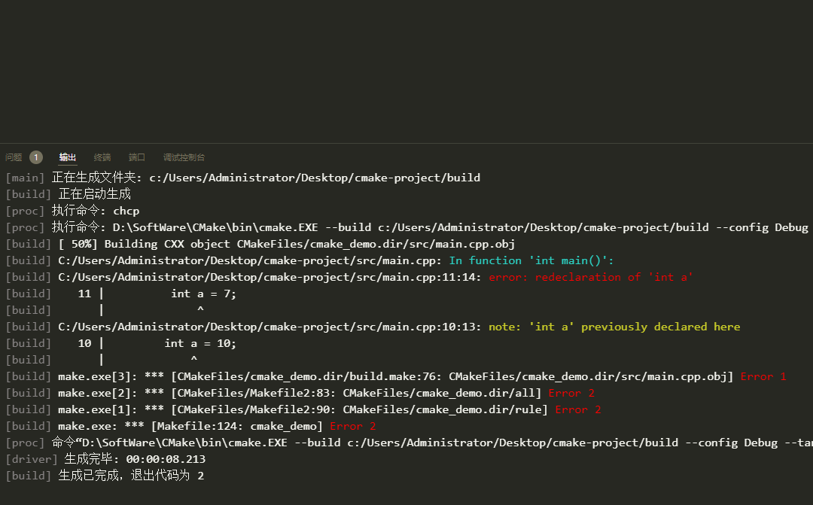

# Build Output Highlight


Build Output Colorizer applies syntax highlighting to the VSCode Output window, restoring colors to build diagnostics that (especially with CMake builds) are stripped away.

highlight type： error, warning, info, debug

error keys like： error,err,fail,failed,failure,fatal,exception,critical

warning keys like： warning, warn, note

All keys are not case-sensitive, more applicable than the original plug-in(Build Output Colorizer), and more matching rules.


## Features

This no-code extension associates syntax highlighting rules to the Output window scope, and uses regexes to select and highlight patterns that are probably error/warning diagnostics.




## Requirements

This extensions should not have any prerequisites or requirements.  The highlighting rules should work with any theme, but the colors are not theme-based (though they are customizable via settings).

## Extension Settings

This extension changes the default for `editor.tokenColorCustomizations` to allow customization of the highlighting.  If you have customizations already, you may need to manually add color settings for the TextMate tokens shown below:
```
{
  "editor.tokenColorCustomizations": {
        "textMateRules": [
            {
              "scope" : "OutputHightlight.log.error",
              "settings": { "foreground": "#FF0000" }
            },
            {
              "scope" : "OutputHightlight.log.warning",
              "settings": { "foreground": "#f1f52acc" }
            },
            {
              "scope" : "OutputHightlight.log.info",
              "settings": { "foreground": "#2cd3c5" }
            },
            {
              "scope" : "OutputHightlight.log.debug",
              "settings": { "foreground": "#888585" }
            }
        ]
      }
}
```
tips:

This also allows for customization to your preferences.It is highly recommended to add the above configurations to the user settings. json instead of the workspace settings. json, so that the configurations will not be lost when switching workspaces, and to avoid highlighting conflicts with other plugins that may prevent them from working!

提示: 

  非常推荐将以上配置添加到用户settings.json中，而不是工作区settings.json中，这样在切换工作区时，不会丢失配置，同时避免与其他插件的高亮冲突导致无法生效


## Known Issues
This extension has a quite limited set of syntax highlighting rules since normally the objective of compiler diagnostics is to draw the user's eye to the highest priority items.

Contributions or suggestions for improvement are welcome.  Please raise an issue at the extension's repository.

## Release Notes


### 0.1.7
inspire from https://github.com/sgbush/buildoutputcolorizer, thanks!

Provides a wider matching range, such as matching Error, while the original version only supports matching error

### 0.1.8
1.增加更好的错误匹配模式，例如：fail，failure，Error等

2.重构代码，修复插件特别容易与其他插件冲突的问题，如Code Runner、File Watcher、Crypto Tools等类似插件冲突，提高插件高亮功能的可用性

3.修复In function关键字的识别，加强识别能力


### 0.1.10
1.恢复在插件不冲突的情况下，链接识别生效的功能。
